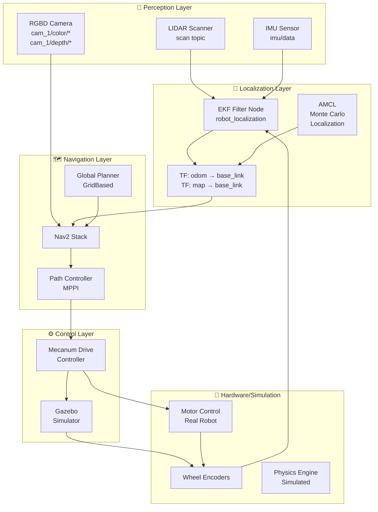
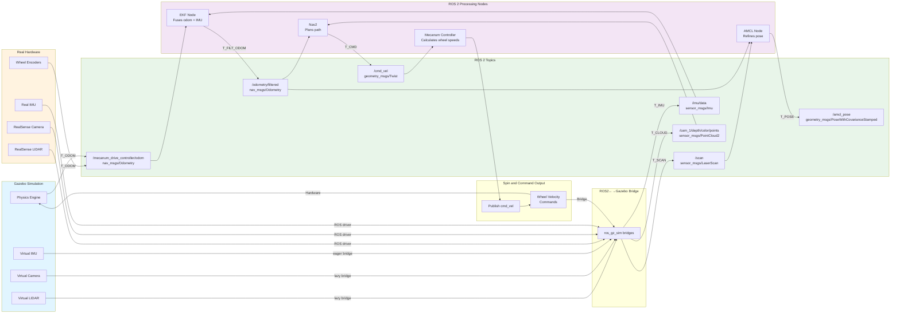

# RN Autonomous - Yahboom ROSMASTER X3 Robot System

A comprehensive ROS 2-based autonomous navigation system for the Yahboom ROSMASTER X3 omnidirectional mobile robot. This system integrates simulation (Gazebo), perception (LIDAR, RGBD Camera, IMU), localization (EKF), and navigation (Nav2) capabilities.

## 🚀 Overview

**rn_autonomous** is a complete robotics stack built on ROS 2 (Jazzy) that enables the ROSMASTER X3 robot to:
- Autonomously navigate using Nav2 navigation framework
- Localize itself using Extended Kalman Filter (EKF) sensor fusion
- Move omnidirectionally with mecanum wheel control
- Perceive the environment with LIDAR and RGBD cameras
- Simulate in Gazebo for development and testing

---

## 📦 System Architecture



---

## 📁 Package Structure

### Core Packages

| Package | Purpose | Functionality |
|---------|---------|---------------|
| **rn_autonomous_description** | Robot Definition | URDF/Xacro models, meshes, kinematics |
| **mecanum_drive_controller** | Drive Control | Omnidirectional wheel kinematics, odometry |
| **rn_autonomous_gazebo** | Simulation | Gazebo worlds, physics, sensors |
| **rn_autonomous_bringup** | Startup | Controller loading, initialization scripts |
| **rn_autonomous_localization** | Pose Estimation | EKF sensor fusion, AMCL particle filter |
| **rn_autonomous_navigation** | Path Planning | Nav2 navigation, path controllers |
| **rn_autonomous_system_tests** | Testing | Integration and system tests |
| **rn_autonomus_msgs** | Messages | Custom ROS message definitions |

---

## 🔄 Complete Data Flow



---

## 🎮 Quick Start

### Prerequisites
```bash
# ROS 2 Jazzy installed
source /opt/ros/jazzy/setup.bash

# Clone workspace
git clone https://github.com/Rishabh-spec-ux/rn_autonomous.git
cd rn_autonomous
```

### Build
```bash
# Install dependencies
rosdep install --from-paths . --ignore-src -r -y

# Build packages
colcon build --symlink-install

# Source setup
source install/setup.bash
```

### Launch Simulation
```bash
# Option 1: Gazebo Simulation with Navigation
ros2 launch rn_autonomous_gazebo rn_autonomous.gazebo.launch.py world_file:=cafe.world

# Option 2: Load Controllers
ros2 launch rn_autonomous_bringup load_ros2_controllers.launch.py

# Option 3: Start Navigation
ros2 launch rn_autonomous_navigation rosmaster_x3_navigation.launch.py use_sim_time:=true
```

### Send Navigation Goals
```bash
# Use RViz to set goal through Nav2 panel
# Or use CLI:
ros2 action send_goal /navigate_to_pose nav2_msgs/action/NavigateToPose \
  "pose: { header: { frame_id: \"map\" }, pose: { position: { x: 1.0, y: 1.0 } } }" \
  --feedback
```

---

## 🔌 Key Topics and Transforms

### Sensor Topics
| Topic | Type | Source | Frequency |
|-------|------|--------|-----------|
| `/scan` | LaserScan | LIDAR | 15 Hz |
| `/imu/data` | Imu | IMU | 15 Hz |
| `/cam_1/color/image_raw` | Image | RGBD Camera | 30 Hz |
| `/cam_1/depth/color/points` | PointCloud2 | RGBD Camera | 30 Hz |

### Command Topics
| Topic | Type | Frequency | Purpose |
|-------|------|-----------|---------|
| `/cmd_vel` | Twist | 10 Hz | Navigation velocity commands |
| `/mecanum_drive_controller/cmd_vel` | TwistStamped | 10 Hz | Raw wheel velocity commands |

### State Topics
| Topic | Type | Source | Purpose |
|-------|------|--------|---------|
| `/odometry/filtered` | Odometry | EKF | Fused pose estimate |
| `/amcl_pose` | PoseWithCovariance | AMCL | Globally localized pose |
| `/mecanum_drive_controller/odom` | Odometry | Controller | Raw encoder odometry |

### Transform Tree (TF)
```
map
  ├─> odom (from AMCL)
  │    └─> base_footprint (from EKF)
  │         └─> base_link
  │            ├─> camera_link
  │            ├─> lidar_link
  │            ├─> imu_link
  │            ├─> wheel_front_left_link
  │            ├─> wheel_front_right_link
  │            ├─> wheel_back_left_link
  │            └─> wheel_back_right_link
```

---

## 🛠️ Configuration Files

### Navigation Config
- `rn_autonomous_navigation/config/rosmaster_x3_nav2_default_params.yaml`
  - AMCL parameters for particle filter localization
  - MPPI controller parameters for path following
  - Costmap configuration

### Localization Config
- `rn_autonomous_localization/config/ekf.yaml`
  - EKF filter setup for sensor fusion
  - Odom and IMU input configuration
  - Frame definitions

### Bridge Config
- `rn_autonomous_gazebo/config/ros_gz_bridge.yaml`
  - Gazebo ↔ ROS 2 topic mappings
  - Sensor data bridging configuration

---

## 📊 System Parameters

### Robot Dimensions
| Parameter | Value | Unit |
|-----------|-------|------|
| Wheel Radius | 0.0325 | m |
| Wheel Base (L) | 0.120 | m |
| Wheel Separation (W) | 0.1665 | m |
| Base Mass | 4.6 | kg |
| Max Velocity (V_max) | 0.5 | m/s |
| Max Angular Velocity | 1.9 | rad/s |

### Controller Parameters
| Parameter | Value | Function |
|-----------|-------|----------|
| Controller Frequency | 5.0 | Hz |
| EKF Update Rate | 15.0 | Hz |
| LIDAR Frequency | 15 | Hz |
| Camera Frequency | 30 | Hz |

---

## 🚨 Troubleshooting

### Robot Spawning Inside Ground
**Problem**: Robot appears underground in Gazebo
```yaml
# Solution: Increase spawn height in launch file
declare_z_cmd = DeclareLaunchArgument(
    name='z',
    default_value='0.15',  # Increased from 0.05
    description='z component of initial position, meters')
```

### No Odometry Data
- Check encoder connections on real robot
- Verify Gazebo physics are running
- Inspect `/mecanum_drive_controller/odom` topic

### Navigation Not Working
- Ensure map is loaded/created
- Check AMCL is converging (monitor `/amcl_pose`)
- Verify `/odometry/filtered` is publishing

### TF Tree Broken
- Confirm `robot_state_publisher` is running
- Check `/tf` and `/tf_static` topics have data
- Use `tf2_tools.py` to visualize tree

---

## 📚 Detailed Package Documentation

See individual package README files:
- [mecanum_drive_controller README](src/rn_autonomous/mecanum_drive_controller/README.md)
- [rn_autonomous_description README](src/rn_autonomous/rn_autonomous_description/README.md)
- [rn_autonomous_gazebo README](src/rn_autonomous/rn_autonomous_gazebo/README.md)
- [rn_autonomous_bringup README](src/rn_autonomous/rn_autonomous_bringup/README.md)
- [rn_autonomous_localization README](src/rn_autonomous/rn_autonomous_localization/README.md)
- [rn_autonomous_navigation README](src/rn_autonomous/rn_autonomous_navigation/README.md)

---

## 📝 License

BSD-3-Clause License

## 🤝 Contributing

Contributions welcome! Please follow ROS 2 coding standards and submit pull requests.

---

**Last Updated**: March 2026  
**ROS 2 Version**: Jazzy  
**Robot Model**: Yahboom ROSMASTER X3
