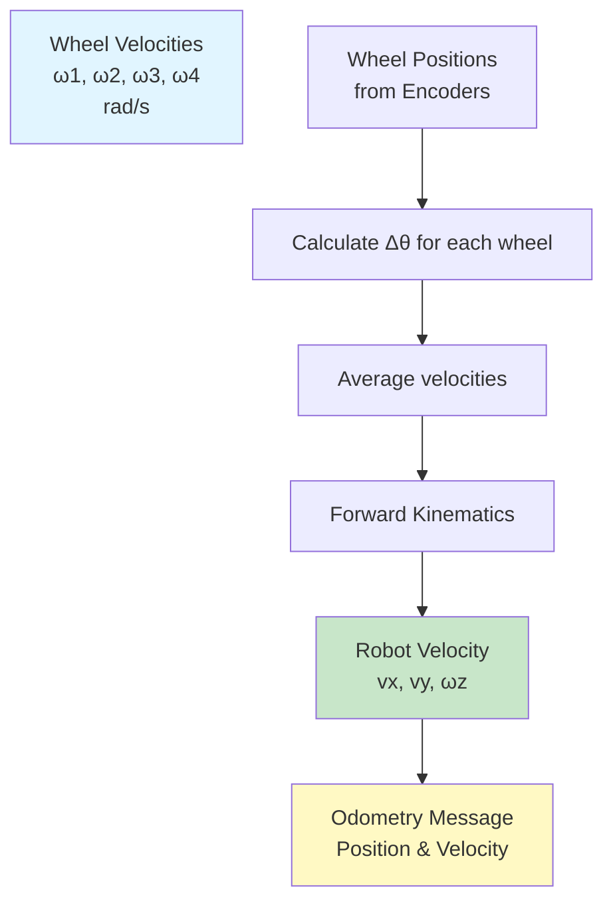
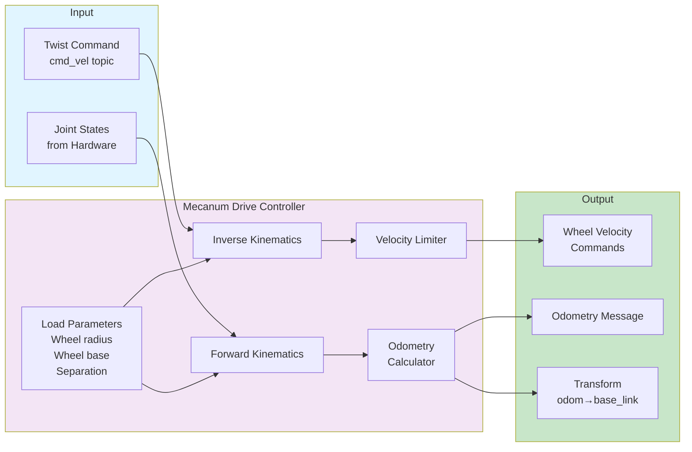
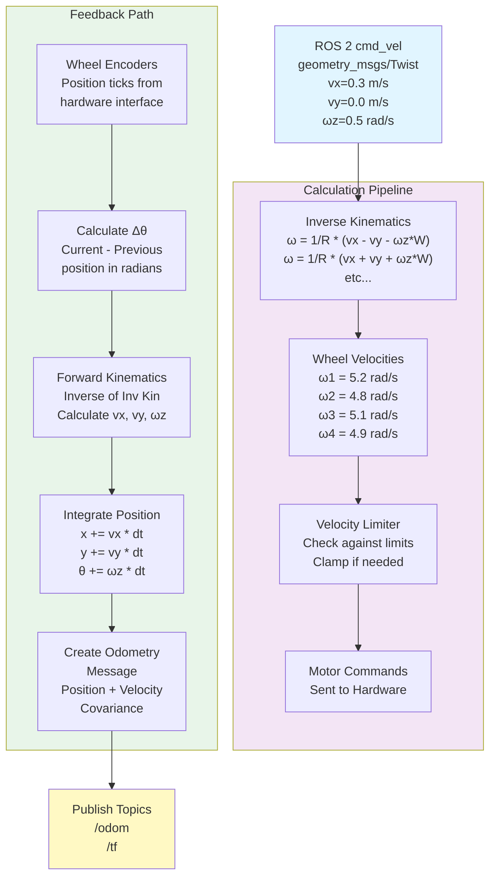

# Mecanum Drive Controller Package

A ROS 2 Control plugin that implements omnidirectional kinematic control for mecanum-wheel mobile robots. This controller converts twist commands into individual wheel velocities and publishes odometry data based on wheel encoder feedback.

## 🎯 Purpose

The Mecanum Drive Controller bridges high-level velocity commands and low-level wheel motor control. It:
- Converts 2D velocity commands (vx, vy, ωz) → 4 wheel velocities
- Implements inverse kinematics for mecanum drive
- Calculates and publishes odometry from encoder feedback
- Broadcasts odom → base_link transform
- Handles real robot hardware and Gazebo simulation

---

## 🔧 Kinematics Model

### Inverse Kinematics (Velocity → Wheel Speeds)

```
ω1 = 1/R1 * (vx - vy - ωz(L + W))  // front left
ω2 = 1/R2 * (vx + vy + ωz(L + W))  // front right
ω3 = 1/R3 * (vx + vy - ωz(L + W))  // back left
ω4 = 1/R4 * (vx - vy + ωz(L + W))  // back right

Where:
R = wheel radius (individual, allows for non-uniform wheels)
L = wheel_base / 2 (distance to front/back wheels)
W = wheel_separation / 2 (distance to left/right wheels)
vx, vy = linear velocities (m/s)
ωz = angular velocity (rad/s)
ω = wheel angular velocity (rad/s)
```

### Forward Kinematics (Wheel Speeds → Velocity)



---

## 📊 Architecture & Control Flow



---

## 📦 Key Components

### Header Files

| File | Responsibility |
|------|-----------------|
| `mecanum_drive_controller.hpp` | Class definition, interface specs |
| `mecanum_drive_controller_parameters.hpp` | Parameter definitions |

### Source Files

| File | Functionality |
|------|---------------|
| `mecanum_drive_controller.cpp` | Main implementation |
| `mecanum_drive_controller_parameters.cpp` | Parameter handling |
| `visibility_control.h` | Symbol visibility |

---

## 🔌 Topics and Interfaces

### Subscribed Topics

| Topic | Type | Purpose |
|-------|------|---------|
| `~/cmd_vel` | geometry_msgs/TwistStamped | High-level velocity commands |

### Published Topics

| Topic | Type | Purpose |
|-------|------|---------|
| `~/odom` | nav_msgs/Odometry | Encoder-based odometry |
| `~/cmd_vel_out` | geometry_msgs/TwistStamped | Limited velocity (debug) |
| `/tf` | tf2_msgs/TFMessage | odom → base_link transform |

### Hardware Interfaces

| Interface | Direction | Purpose |
|-----------|-----------|---------|
| velocity | Output | Sends wheel velocity commands |
| position | Input | Receives wheel encoder positions |

---

## ⚙️ Configuration Parameters

```yaml
mecanum_drive_controller:
  ros__parameters:
    # Wheel parameters (meters, kilograms)
    wheel_radius: 0.0325          # Wheel radius in meters
    wheel_base: 0.120             # Distance between front and back wheels
    wheel_separation: 0.1665      # Distance between left and right wheels
    wheel_mass: 0.1               # Mass of each wheel
    wheel_moment_of_inertia: 0.00125
    
    # Control interface
    position_feedback: true       # Use position or velocity feedback
    feedback_type: velocity
    
    # Limits and safety
    linear_x_velocity_limit: 0.5   # m/s
    linear_y_velocity_limit: 0.5   # m/s
    angular_velocity_limit: 1.9    # rad/s
    
    # Odometry configuration
    odom_frame_id: odom
    base_link_frame_id: base_link
    base_footprint_frame_id: base_footprint
    
    # Publishing settings
    publish_odometry: true
    publish_odom_tf: true
    odometry_covariance_diagonal:
      [0.0001, 0.0, 0.0, 0.0, 0.0, 0.0001]
```

---

## 🚀 Lifecycle and Execution

```mermaid
stateDiagram-v2
    [*] --> Unconfigured: Created
    Unconfigured --> Inactive: configure()
    Inactive --> Active: activate()
    Active --> Idle: deactivate()
    Idle --> Inactive: stop()
    Inactive --> Unconfigured: cleanup()
    Unconfigured --> [*]: Destroyed
    
    Active --> Active: on_update()\nProcesses cmd_vel\nPublishes odom
    
    note right of Active
        Main control loop:
        1. Read twist command
        2. Apply inverse kinematics
        3. Limit velocities
        4. Send wheel commands
        5. Read encoder positions
        6. Calculate odometry
        7. Publish odom & TF
    end
```

---

## 🔄 Data Flow Diagram



---

## 🔨 Building & Testing

### Dependencies
```xml
<depend>controller_interface</depend>
<depend>geometry_msgs</depend>
<depend>hardware_interface</depend>
<depend>nav_msgs</depend>
<depend>pluginlib</depend>
<depend>rclcpp</depend>
<depend>realtime_tools</depend>
<depend>tf2</depend>
```

### Build
```bash
cd ~/workspace
colcon build --packages-select mecanum_drive_controller
source install/setup.bash
```

### Run Tests
```bash
colcon test --packages-select mecanum_drive_controller
colcon test-result --all --verbose
```

---

## 🐛 Debugging & Performance

### Monitor Odometry
```bash
# Check odometry publishing
ros2 topic echo /mecanum_drive_controller/odom

# Check wheel commands
ros2 topic echo /mecanum_drive_controller/cmd_vel_out

# Monitor transform tree
ros2 run tf2_tools view_frames.py

# Real-time visualization
rviz2 -d config/mecanum_controller.rviz
```

### Common Issues

| Issue | Cause | Solution |
|-------|-------|----------|
| Robot not moving | Wrong motor signs | Reverse wheel directions in hardware config |
| Drifting off course | Wheel radius mismatch | Calibrate actual wheel radius |
| Jerky motion | Velocity limits too low | Increase limits in params |
| Odometry jumps | Encoder overflow | Check encoder reset frequency |

---

## 📚 Mathematics Reference

### Matrix Form of Inverse Kinematics

```
[ω1]      1  [-1  -1  -(L+W)]  [vx]
[ω2]  =  ---  [1   1   (L+W)]  [vy]
[ω3]     R_avg [1   1  -(L+W)]  [ωz]
[ω4]      [1  -1   (L+W)]
```

Where R_avg is average wheel radius.

### Odometry Covariance Model

```
Position covariance:
σ_x = σ_y = wheel_slip_factor * √(ω_sum)

Yaw covariance:
σ_θ = differential_slip_factor * |ω_left - ω_right|
```

---

## 🔗 Integration Points

This controller integrates with:
- **ROS 2 Control Framework**: As a ControllerInterface plugin
- **Hardware Interface**: Reads/writes to joint state interface
- **Gazebo**: Through ros_gz_system_plugin
- **Nav2**: Receives Twist commands on `/cmd_vel`
- **robot_localization**: Provides odometry for sensor fusion

---

## 📝 License

BSD-3-Clause License

---

**Package Author**: Addison Sears-Collins  
**ROS 2 Version**: Jazzy  
**Robot Model**: Yahboom ROSMASTER X3  
**Last Updated**: March 2026
