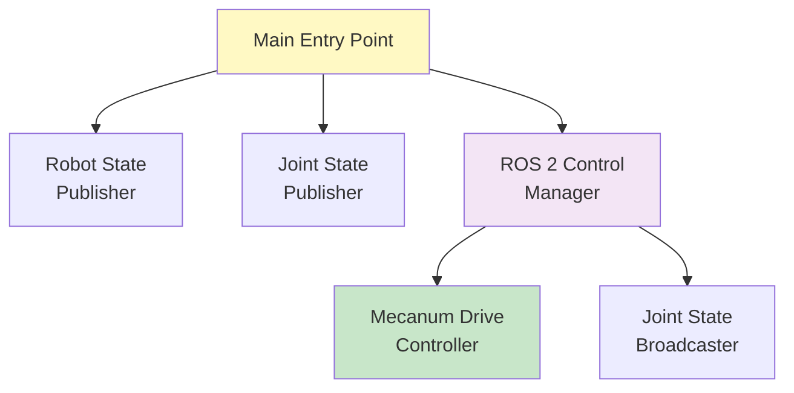
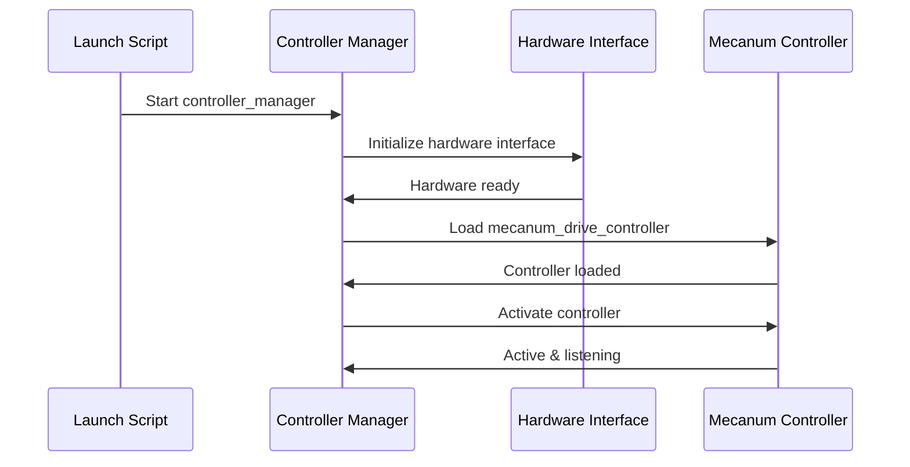
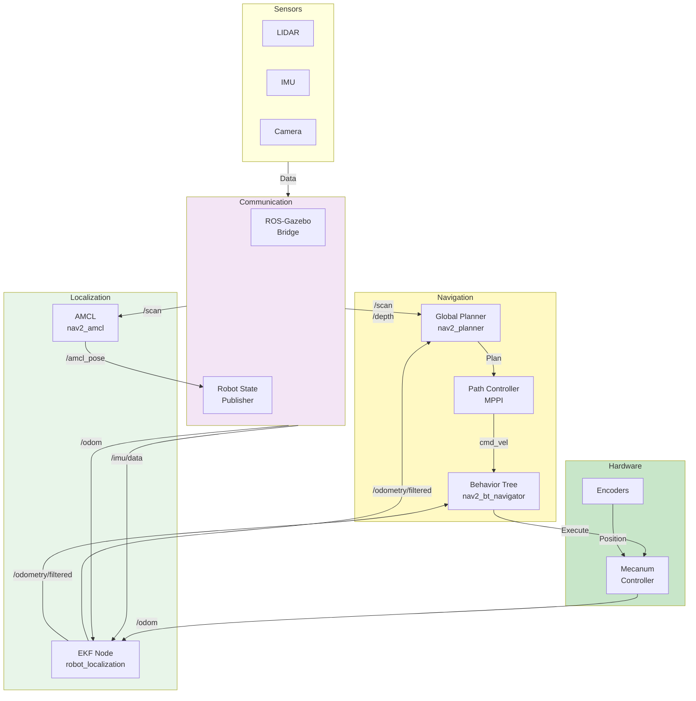
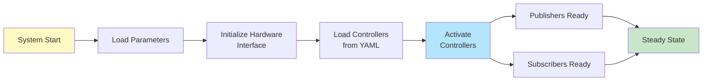
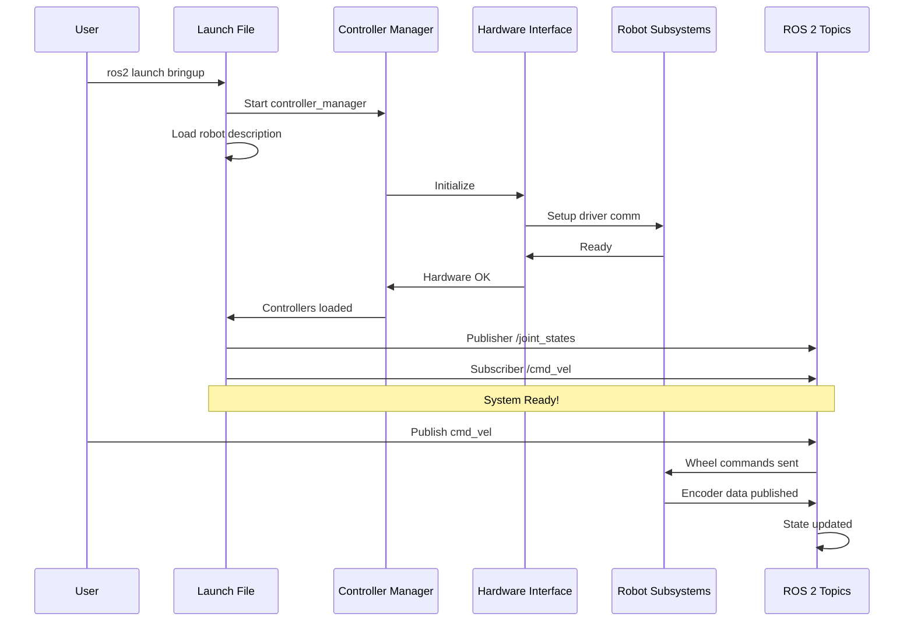

# RN Autonomous Bringup Package

Startup and initialization package for the ROSMASTER X3 robot. Contains launch scripts and configuration for starting the robot's core subsystems including ROS 2 Control and hardware interfaces.

## 🚀 Purpose

This package provides:
- **Controller Loading**: ROS 2 Control manager and controller initialization
- **Hardware Setup**: Configuration files for real hardware interfaces
- **Navigation Startup**: Complete navigation stack initialization
- **System Integration**: Orchestration of multiple system components

---

## 📦 Contents

```
rn_autonomous_bringup/
├── launch/
│   ├── load_ros2_controllers.launch.py      # Controller manager startup
│   └── rosmaster_x3_navigation.launch.py    # Full navigation stack
├── scripts/
│   ├── robot_startup.sh                     # Hardware startup script
│   └── sim_startup.sh                       # Simulation startup script
├── config/
│   └── controllers.yaml                     # Controller definitions
└── README.md (this file)
```

---

## 🔗 Launch Hierarchy



---

## 📋 Launch Scripts

### 1. load_ros2_controllers.launch.py

Loads and starts the ROS 2 Control system.

#### What It Does



#### Usage

```bash
# Basic launch (simulation)
ros2 launch rn_autonomous_bringup load_ros2_controllers.launch.py

# With real robot hardware
ros2 launch rn_autonomous_bringup load_ros2_controllers.launch.py \
  use_sim_time:=false

# Specific controller configuration
ros2 launch rn_autonomous_bringup load_ros2_controllers.launch.py \
  controllers_config:=/path/to/custom_controllers.yaml
```

#### Arguments

| Argument | Default | Type | Description |
|----------|---------|------|-------------|
| `use_sim_time` | `true` | bool | Use Gazebo clock or system clock |
| `joint_state_publisher_type` | `default` | string | Joint state publisher type |
| `controllers_file` | `controllers.yaml` | string | Controllers config file |

---

### 2. rosmaster_x3_navigation.launch.py

Complete navigation stack setup for path planning and autonomous mobility.

#### System Components



#### Usage

```bash
# Simulation environment
ros2 launch rn_autonomous_bringup rosmaster_x3_navigation.launch.py \
  use_sim_time:=true \
  map:=cafe_map

# Real robot
ros2 launch rn_autonomous_bringup rosmaster_x3_navigation.launch.py \
  use_sim_time:=false \
  map:=/path/to/map.yaml
```

#### Arguments

| Argument | Default | Type | Purpose |
|----------|---------|------|---------|
| `use_sim_time` | `true` | bool | Simulation vs real-time |
| `map` | `empty_map` | string | Initial map file |
| `use_rviz` | `true` | bool | Launch RViz visualization |
| `use_sim` | `true` | bool | Simulation mode |
| `bot_namespace` | `""` | string | Robot namespace |

---

## ⚙️ Controller Configuration

**File**: `config/controllers.yaml`

### Structure

```yaml
controller_manager:
  ros__parameters:
    # Controller update rate
    update_rate: 100  # Hz
    
    # List of controllers to load
    use_sim_time: true

mecanum_drive_controller:
  ros__parameters:
    # Kinematics
    wheel_radius: 0.0325
    wheel_base: 0.120
    wheel_separation: 0.1665
    
    # Motion limits
    linear_x_velocity_limit: 0.5
    linear_y_velocity_limit: 0.5
    angular_velocity_limit: 1.9
    
    # Interfaces
    position_feedback: true
    
    # Publishing
    publish_odometry: true
    publish_odom_tf: true

joint_state_broadcaster:
  ros__parameters:
    use_sim_time: true
```

---

## 📊 Data Flow During Bringup



---

## 🔄 Complete Startup Sequence



---

## 🎯 Key Topics and Services

### Published Topics

| Topic | Type | Frequency | Purpose |
|-------|------|-----------|---------|
| `/joint_states` | JointState | 50 Hz | Joint positions/velocities |
| `/tf` | TransformStamped | 10 Hz | Transform tree updates |
| `/odometry/filtered` | Odometry | 15 Hz | Fused odometry |
| `/amcl_pose` | PoseWithCovariance | 2 Hz | Localized pose |

### Subscribed Topics

| Topic | Type | Purpose |
|-------|------|---------|
| `/cmd_vel` | Twist | Navigation velocity commands |
| `/robot_description` | String | URDF description |
| `/clock` | Clock | Gazebo simulation time |

### Services

| Service | Type | Purpose |
|---------|------|---------|
| `/controller_manager/list_controllers` | ListControllers | Query active controllers |
| `/controller_manager/load_controller` | LoadController | Dynamically load controller |
| `/controller_manager/switch_controller` | SwitchController | Switch between controllers |

---

## 🛠️ Real Robot Hardware Setup

### Prerequisites

1. **Install Dependencies**
   ```bash
   sudo apt install ros-jazzy-ros2-control
   sudo apt install ros-jazzy-ros2-controllers
   sudo apt install ros-jazzy-hardware-interface
   ```

2. **Hardware Driver Setup**
   - ROSMASTER motor drivers installed
   - Serial/CAN connection configured
   - Permissions set for device access

### Hardware Configuration

```yaml
control_hardware:
  config:
    type: rosmaster_hardware_interface
    port: /dev/ttyUSB0
    baud_rate: 115200
    timeout: 1.0  # seconds
```

### Running on Real Robot

```bash
# 1. Check hardware connection
ros2 run rn_autonomous_bringup check_hardware.py

# 2. Load controllers (no sim_time)
ros2 launch rn_autonomous_bringup load_ros2_controllers.launch.py \
  use_sim_time:=false

# 3. Verify communication
ros2 topic echo /joint_states

# 4. Start navigation
ros2 launch rn_autonomous_bringup rosmaster_x3_navigation.launch.py \
  use_sim_time:=false
```

---

## 📁 Scripts

### robot_startup.sh

```bash
#!/bin/bash

# Source ROS setup
source /opt/ros/jazzy/setup.bash
source ~/colcon_ws/install/setup.bash

# Check hardware connection
echo "Checking hardware..."
ros2 run rn_autonomous_bringup check_hardware.py

if [ $? -eq 0 ]; then
    echo "Hardware OK"
    # Start navigation
    ros2 launch rn_autonomous_bringup rosmaster_x3_navigation.launch.py
else
    echo "Hardware check failed!"
    exit 1
fi
```

### sim_startup.sh

```bash
#!/bin/bash

# Source ROS setup
source /opt/ros/jazzy/setup.bash
source ~/colcon_ws/install/setup.bash

# Start Gazebo
ros2 launch rn_autonomous_gazebo rn_autonomous.gazebo.launch.py &

sleep 3

# Load controllers
ros2 launch rn_autonomous_bringup load_ros2_controllers.launch.py

# Start navigation
ros2 launch rn_autonomous_bringup rosmaster_x3_navigation.launch.py \
  use_sim_time:=true
```

---

## 🐛 Troubleshooting

### Controllers Not Loading

**Problem**: `Failed to load controller`

**Solution**:
```bash
# Check controller configuration
ros2 service call /controller_manager/list_controllers

# Verify YAML syntax
python3 -c "import yaml; yaml.safe_load(open('controllers.yaml'))"
```

### No Joint States Published

**Problem**: `/joint_states` topic empty

**Solution**:
```bash
# Ensure joint_state_broadcaster is active
ros2 service call /controller_manager/list_controllers

# Manually activate if needed
ros2 service call /controller_manager/switch_controller \
  "{start_controllers: ['joint_state_broadcaster'], stop_controllers: []}"
```

### Hardware Not Found

**Problem**: `Hardware interface not detected`

**Solution**:
```bash
# Check USB connection
lsusb

# List device ports
ls -la /dev/ttyUSB*

# Set permissions
sudo chmod 666 /dev/ttyUSB0
```

---

## 🔗 Integration with Other Packages

```
rn_autonomous_bringup
├── depends on → rn_autonomous_description (robot URDF)
├── depends on → mecanum_drive_controller (motor control)
├── depends on → rn_autonomous_localization (sensor fusion)
├── depends on → rn_autonomous_navigation (path planning)
└── depends on → rn_autonomous_gazebo (simulation)
```

---

## 📝 License

BSD-3-Clause License

---

**Last Updated**: March 2026  
**ROS 2 Version**: Jazzy  
**Robot Model**: Yahboom ROSMASTER X3
