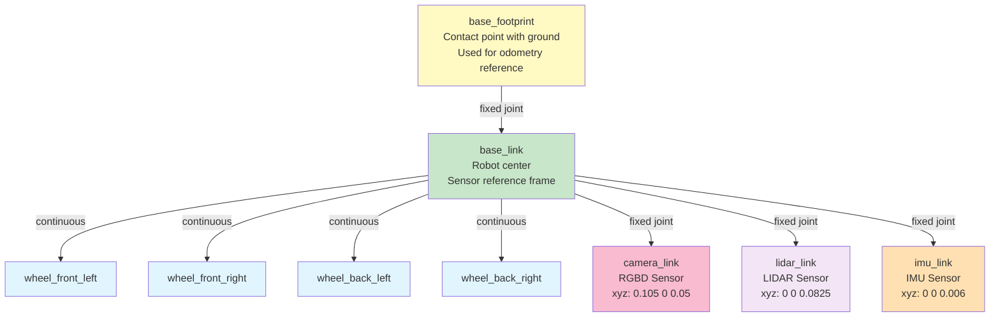

# RN Autonomous Description Package

Comprehensive robot description package for the Yahboom ROSMASTER X3 mobile robot. Contains URDF/Xacro files defining the robot's geometry, kinematics, dynamics, visual properties, sensors, and control interfaces.

## 🤖 What is Robot Description?

Robot Description is the foundation of any ROS 2 robot system. It defines:
- **Kinematic Structure**: Links (rigid bodies) and joints (connections)
- **Visual Representation**: 3D meshes and appearance for RViz
- **Collision Geometry**: Shapes for physics simulation and collision detection
- **Inertial Properties**: Mass and moment of inertia for dynamics
- **Sensor Placements**: Positions and orientations of cameras, LIDARs, IMUs
- **Control Interfaces**: Motor interfaces and controller definitions
- **Dynamic Simulation**: Gazebo plugins for physics and sensors

---

## 📐 URDF File Hierarchy

```
urdf/
├── robots/
│   └── rosmaster_x3.urdf.xacro          # Main robot definition
│       (Includes and composes all modules)
│
├── mech/
│   ├── rosmaster_x3_base.urdf.xacro     # Base platform geometry
│   └── mecanum_wheel.urdf.xacro         # Wheel macro (×4)
│
├── sensors/
│   ├── rgbd_camera.urdf.xacro           # RealSense RGBD
│   ├── lidar.urdf.xacro                 # 2D/3D LIDAR
│   └── imu.urdf.xacro                   # Inertial Measurement Unit
│
└── control/
    ├── velocity_control_plugin.urdf.xacro     # Velocity plugin
    ├── gazebo_sim_ros2_control.urdf.xacro     # Gazebo control
    └── rosmaster_x3_ros2_control.urdf.xacro   # ROS 2 Control setup
```

---

## 🏗️ Robot Structure

### Coordinate Frames and Hierarchy



---

## 🔩 Key Xacro Macros

### 1. Base Link Definition

**File**: `mech/rosmaster_x3_base.urdf.xacro`

Base Box Dimensions:
- **X (Length)**: 0.300 m
- **Y (Width)**: 0.1597 m  (total_width - 2×wheel_width)
- **Z (Height)**: 0.164 m   (total_height - 2×wheel_radius)
- **Mass**: 4.6 kg

Collision geometry centered at:
- **Z-offset**: base_size_z/2 + wheel_radius/4 (lifts collision box slightly)

### 2. Mecanum Wheel Macro

**File**: `mech/mecanum_wheel.urdf.xacro`

Creates four wheels (Front-Left, Front-Right, Back-Left, Back-Right):
- **Radius**: 0.0325 m
- **Width**: 0.0304 m
- **Mass (each)**: 0.35 kg
- **Joint Type**: Continuous (unlimited rotation)

**Positions** relative to base_link center:
```
Front-Left:   (+0.060 m, +0.0825 m, -0.01625 m)
Front-Right:  (+0.060 m, -0.0825 m, -0.01625 m)
Back-Left:    (-0.060 m, +0.0825 m, -0.01625 m)
Back-Right:   (-0.060 m, -0.0825 m, -0.01625 m)
```

### 3. Sensors

| Sensor | Type | Placement | Specification |
|--------|------|-----------|----------------|
| **RGBD Camera** | RealSense | +0.105 m forward, 0.05 m up | 640×480, 30Hz, 60° FOV |
| **LIDAR** | GPU LIDAR | top center, 0.0825 m up | 360° scan, 15Hz, 120m range |
| **IMU** | 6-DOF | center, 0.006 m up | 15Hz, angular & linear |

---

## ⚙️ Dynamics & Control

### ROS 2 Control System

```
Hardware Abstraction Layer
├── Command Interface (Output)
│   └── Joint Velocity Commands for 4 wheels
└── State Interface (Input)
    ├── Joint Positions (encoder ticks)
    └── Joint Velocities (calculated)
```

### Gazebo Plugins Used

1. **gz-sim-physics-system**: ODE physics engine
2. **gz-sim-sensor-system**: Sensor data generation
3. **gz-sim-camera-sensor**: RGBD camera simulation
4. **gz-sim-imu-system**: IMU simulation
5. **gz_ros2_control**: Bridges ROS 2 Control to Gazebo

---

## 🚀 Usage

### Process Xacro to URDF

```bash
ros2 run xacro xacro \
  $(ros2 pkg prefix rn_autonomous_description)/urdf/robots/rosmaster_x3.urdf.xacro \
  > /tmp/rosmaster.urdf
```

### Validate URDF

```bash
check_urdf /tmp/rosmaster.urdf
urdf_to_graphviz /tmp/rosmaster.urdf
```

### Launch Robot Description

```bash
ros2 launch rn_autonomous_description robot_state_publisher.launch.py
```

### Visualize in RViz

```bash
rviz2 -d install/rn_autonomous_description/share/rn_autonomous_description/rviz/default.rviz
```

---

## 📋 Key Parameters & Dimensions

### Overall Dimensions
| Property | Value | Unit |
|----------|-------|------|
| Length | 0.300 | m |
| Width | 0.19940 | m |
| Height | 0.26225 | m |
| Mass | 5.65 | kg |

### Wheel Specifications
| Property | Value | Unit |
|----------|-------|------|
| Radius | 0.0325 | m |
| Width | 0.0304 | m |
| Mass (each) | 0.35 | kg |
| Separation (center-to-center) | 0.1665 | m |

---

## 📁 File Organization

```
rn_autonomous_description/
├── urdf/               # URDF/Xacro files
├── meshes/             # 3D mesh files (STL)
├── launch/             # Launch scripts
├── rviz/               # RViz configuration files
├── config/             # Parameter files
└── doc/                # Documentation
```

---

## 🔗 Integration

Used by:
- **rn_autonomous_gazebo**: Robot spawning
- **rn_autonomous_bringup**: Controller loading  
- **mecanum_drive_controller**: Kinematic model
- **Nav2**: TF tree and visualization

---

## 📝 License

BSD-3-Clause License

---

**Last Updated**: March 2026  
**ROS 2 Version**: Jazzy  
**Robot Model**: Yahboom ROSMASTER X3

