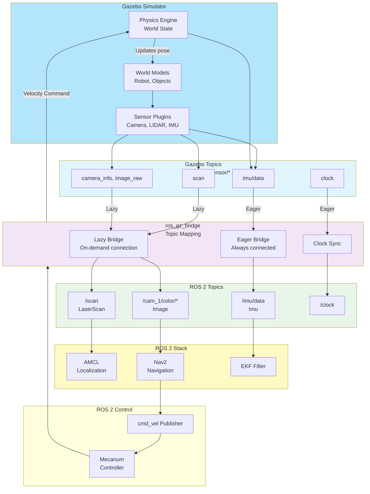
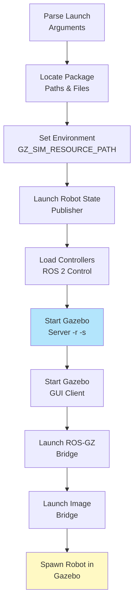
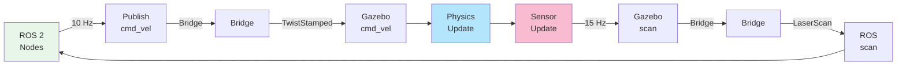

# RN Autonomous Gazebo Package

Gazebo simulation environment for the Yahboom ROSMASTER X3 robot. Provides physics simulation, sensor simulation, world definitions, and ROS 2 integration through the Gazebo bridge system.

## 🎮 Purpose

This package enables:
- **Physics Simulation**: Realistic robot dynamics with ODE physics engine
- **Sensor Simulation**: Virtual LIDAR, RGBD camera, and IMU sensors
- **Development Testing**: Full navigation stack testing without hardware
- **ROS 2 Integration**: Seamless topic bridging between Gazebo and ROS 2
- **Multiple Environments**: Different world files (empty, cafe, house, etc.)

---

## 🌍 World Files

```
worlds/
├── empty.world           # Minimal environment for testing
├── cafe.world            # Realistic cafe with tables and obstacles
├── house.world           # Indoor house environment
└── pick_and_place.world  # Demo environment
```

### World Structure Example (cafe.world)

```xml
<!-- Physics Engine -->
<plugin name="gz::sim::systems::Physics">
  <!-- ODE solver configuration -->
</plugin>

<!-- User Command System -->
<plugin name="gz::sim::systems::UserCommands"/>

<!-- Scene Updates -->
<plugin name="gz::sim::systems::SceneBroadcaster"/>

<!-- Sensor System -->
<plugin name="gz::sim::systems::Sensors">
  <render_engine>ogre2</render_engine>
</plugin>

<!-- Lighting -->
<light type="directional" name="sun">
  <pose>0 0 10 0 0 0</pose>
  <intensity>1</intensity>
</light>

<!-- Ground Plane -->
<model name="ground_plane">
  <static>true</static>
  <link name="link">
    <collision>
      <geometry>
        <plane><normal>0 0 1</normal></plane>
      </geometry>
    </collision>
    <visual>...</visual>
  </link>
</model>

<!-- Scene Objects -->
<include><uri>model://cafe</uri></include>
<include><uri>model://cafe_table</uri></include>
```

---

## 🔄 Gazebo ↔ ROS 2 Bridge Architecture



---

## 🌉 ROS 2 ↔ Gazebo Bridge Configuration

**File**: `config/ros_gz_bridge.yaml`

### Bridge Entries

```yaml
# RGBD Camera - Lazy Bridge (starts on subscriber demand)
- ros_topic_name: "cam_1/color/camera_info"
  gz_topic_name: "cam_1/camera_info"
  ros_type_name: "sensor_msgs/msg/CameraInfo"
  gz_type_name: "gz.msgs.CameraInfo"
  direction: GZ_TO_ROS
  lazy: true

# Point Cloud - Lazy Bridge
- ros_topic_name: "cam_1/depth/color/points"
  gz_topic_name: "cam_1/points"
  ros_type_name: "sensor_msgs/msg/PointCloud2"
  gz_type_name: "gz.msgs.PointCloudPacked"
  direction: GZ_TO_ROS
  lazy: true

# LIDAR Scan - Eager Bridge (always connected)
- ros_topic_name: "scan"
  gz_topic_name: "scan"
  ros_type_name: "sensor_msgs/msg/LaserScan"
  gz_type_name: "gz.msgs.LaserScan"
  direction: GZ_TO_ROS
  lazy: false

# IMU Data - Eager Bridge
- ros_topic_name: "imu/data"
  gz_topic_name: "imu/data"
  ros_type_name: "sensor_msgs/msg/Imu"
  gz_type_name: "gz.msgs.IMU"
  direction: GZ_TO_ROS
  lazy: false

# Velocity Commands - ROS to Gazebo
- ros_topic_name: "mecanum_drive_controller/cmd_vel"
  gz_topic_name: "mecanum_drive_controller/cmd_vel"
  ros_type_name: "geometry_msgs/msg/TwistStamped"
  gz_type_name: "gz.msgs.Twist"
  direction: ROS_TO_GZ
  lazy: false

# Clock Sync - Essential for sim_time
- ros_topic_name: "clock"
  gz_topic_name: "clock"
  ros_type_name: "rosgraph_msgs/msg/Clock"
  gz_type_name: "gz.msgs.Clock"
  direction: GZ_TO_ROS
  lazy: false
```

### Bridge Connection Types

| Type | Purpose | Use Case |
|------|---------|----------|
| **Lazy** | On-demand connection | Sensors used intermittently (camera) |
| **Eager** | Always connected | Critical sensors (LIDAR, IMU, clock) |
| **GZ_TO_ROS** | Gazebo publishes to ROS | Sensor data flow |
| **ROS_TO_GZ** | ROS publishes to Gazebo | Command flow |

---

## 🚀 Launch System

**File**: `launch/rn_autonomous.gazebo.launch.py`

### Launch Flow



### Launch Arguments

| Argument | Default | Type | Purpose |
|----------|---------|------|---------|
| `world_file` | `empty.world` | string | Which world file to load |
| `headless` | `False` | bool | Disable Gazebo GUI |
| `use_sim_time` | `true` | bool | Use Gazebo clock |
| `use_rviz` | `true` | bool | Launch RViz visualization |
| `use_robot_state_pub` | `true` | bool | Publish robot TF |
| `load_controllers` | `true` | bool | Load ROS2 controllers |
| `robot_name` | `rosmaster_x3` | string | Robot model name |

### Spawn Position Arguments

| Argument | Default | Unit | Purpose |
|----------|---------|------|---------|
| `x` | `0.0` | m | X position in world |
| `y` | `0.0` | m | Y position in world |
| `z` | `0.05` | m | Z position (height above ground) |
| `roll` | `0.0` | rad | Roll orientation |
| `pitch` | `0.0` | rad | Pitch orientation |
| `yaw` | `0.0` | rad | Yaw orientation |

---

## 🎟️ Usage Examples

### Basic Simulation - Empty World

```bash
# Terminal 1: Launch Gazebo with robot
ros2 launch rn_autonomous_gazebo rn_autonomous.gazebo.launch.py \
  world_file:=empty.world

# Terminal 2: Start navigation
ros2 launch rn_autonomous_navigation rosmaster_x3_navigation.launch.py \
  use_sim_time:=true

# Terminal 3: Send goal
ros2 action send_goal /navigate_to_pose nav2_msgs/action/NavigateToPose \
  "pose: {header: {frame_id: 'map'}, pose: {position: {x: 1.0, y: 1.0}}}"
```

### Cafe World with Obstacles

```bash
ros2 launch rn_autonomous_gazebo rn_autonomous.gazebo.launch.py \
  world_file:=cafe.world \
  use_rviz:=true
```

### Headless Simulation (No GUI)

```bash
ros2 launch rn_autonomous_gazebo rn_autonomous.gazebo.launch.py \
  world_file:=cafe.world \
  headless:=true \
  use_rviz:=true
```

### Custom Spawn Position

```bash
ros2 launch rn_autonomous_gazebo rn_autonomous.gazebo.launch.py \
  x:=2.0 \
  y:=3.0 \
  z:=0.15 \
  yaw:=1.57  # 90 degrees
```

---

## 📊 Sensor Simulation Details

### LIDAR Specification

```
Type: GPU-based ray-casting
Horizontal FOV: 360° (full circle)
Samples per scan: 360
Range: 0.27 - 120 m
Update rate: 15 Hz
```

### RGBD Camera Specification

```
Type: RealSense simulation
Resolution: 640 × 480 pixels
Horizontal FOV: 60°
Depth range: 0.1 - 10 m
RGB frame rate: 30 Hz
Depth frame rate: 30 Hz
```

### IMU Specification

```
Type: 6-DOF IMU
Angular velocity noise: σ = 0.009 rad/s
Linear acceleration noise: σ = 0.021 m/s²
Update rate: 15 Hz
```

---

## 🔌 Topic Flow During Runtime



---

## 🛠️ Configuration Files

| File | Purpose |
|------|---------|
| `config/ros_gz_bridge.yaml` | Topic bridging configuration |
| `launch/rn_autonomous.gazebo.launch.py` | Main simulation launcher |
| `models/` | Custom Gazebo models |
| `worlds/` | Simulation environment files |

---

## 🔧 Gazebo Environment Variables

```bash
# Gazebo model path (includes our models)
export GZ_SIM_RESOURCE_PATH=$GZ_SIM_RESOURCE_PATH:$(ros2 pkg prefix rn_autonomous_gazebo)/models

# Gazebo plugin path
export GZ_SIM_SYSTEM_PLUGIN_PATH=$GZ_SIM_SYSTEM_PLUGIN_PATH:/usr/lib/x86_64-linux-gnu/gz-sim-8/plugins

# Verbose output
export GZ_SIM_LOG_LEVEL=3
```

---

## ⚠️ Troubleshooting

### Robot Spawning Inside Ground

**Problem**: Robot appears underground or intersecting with ground plane

**Solution**: Increase spawn Z position
```bash
ros2 launch rn_autonomous_gazebo rn_autonomous.gazebo.launch.py z:=0.15
```

### No Sensor Data

**Problem**: Sensor topics not receiving data

**Solution**: Check bridge configuration and lazy settings
```bash
# Verify topics exist
ros2 topic list
ros2 topic echo /scan
```

### Physics Unstable

**Problem**: Robot bouncing, oscillating motion

**Solution**: Adjust physics parameters
```yaml
# In launch file:
max_step_size: 0.0005  # Reduce from 0.001
```

### Gazebo Crashes

**Problem**: Gazebo exits unexpectedly

**Solution**: Check GPU resources
```bash
# Run headless (CPU only)
ros2 launch rn_autonomous_gazebo rn_autonomous.gazebo.launch.py \
  headless:=true
```

---

## 🎛️ Performance Optimization

### For CPU-Limited Systems

```bash
ros2 launch rn_autonomous_gazebo rn_autonomous.gazebo.launch.py \
  headless:=true \
  world_file:=empty.world
```

### For Better Physics Accuracy

```yaml
# Decrease step size and increase update rate
max_step_size: 0.0005
real_time_update_rate: 2000.0
```

---

## 📁 Directory Structure

```
rn_autonomous_gazebo/
├── launch/
│   └── rn_autonomous.gazebo.launch.py
├── worlds/
│   ├── empty.world
│   ├── cafe.world
│   ├── house.world
│   └── pick_and_place_demo.world
├── models/
│   ├── cafe/
│   ├── cafe_table/
│   └── house/
├── config/
│   └── ros_gz_bridge.yaml
├── rviz/
│   └── rn_autonomous_gazebo_sim.rviz
└── README.md (this file)
```

---

## 🔗 Integration Points

**Used with**:
- **rn_autonomous_description**: Provides robot model
- **mecanum_drive_controller**: Sends wheel commands
- **rn_autonomous_bringup**: Loads controller configs
- **rn_autonomous_navigation**: Navigation testing environment
- **rn_autonomous_localization**: Sensor fusion testing

---

## 📝 License

BSD-3-Clause License

---

**Last Updated**: March 2026  
**ROS 2 Version**: Jazzy  
**Gazebo Version**: Garden/Harmonic  
**Robot Model**: Yahboom ROSMASTER X3
