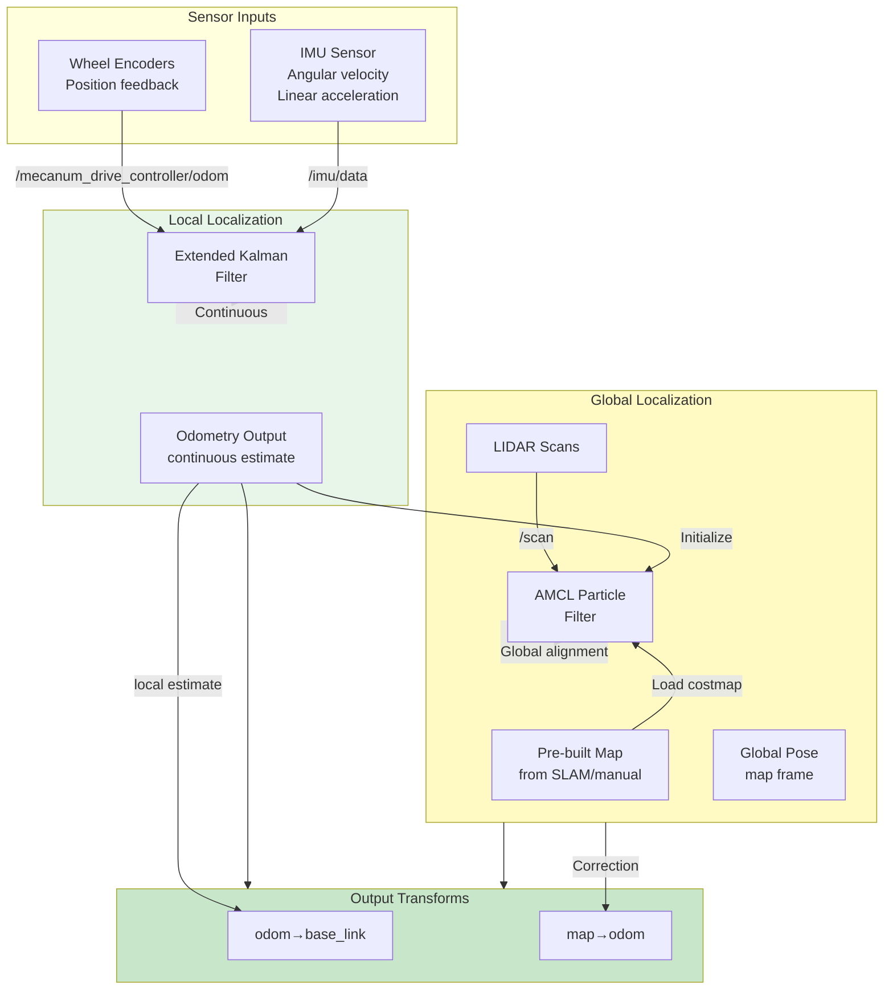
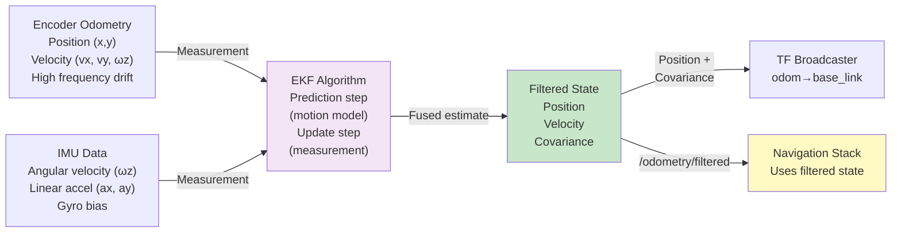
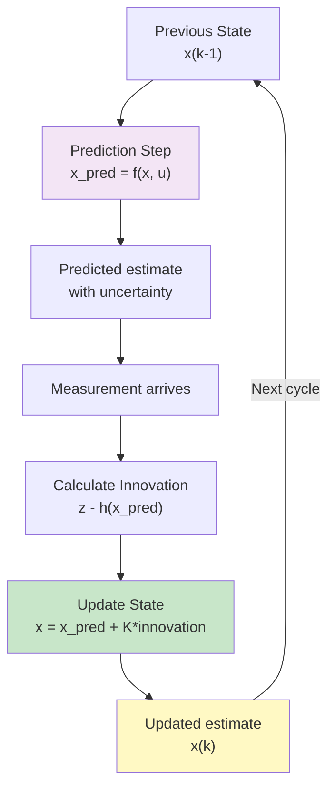
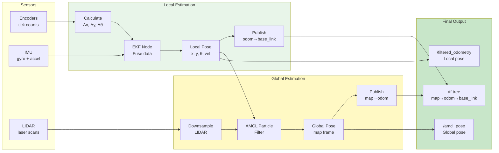

# RN Autonomous Localization Package

Sensor fusion and localization package for the ROSMASTER X3 robot. Combines wheel odometry and IMU data using Extended Kalman Filter (EKF) for robust position estimation. Also includes AMCL-based global localization against a known map.

## 🎯 Purpose

This package provides:
- **Sensor Fusion**: EKF combines odometry + IMU for accurate pose estimation
- **Local Localization**: Maintains continuous pose estimate with low drift
- **Global Localization**: Aligns robot to map using particle filter (AMCL)
- **Transform Broadcasting**: Publishes odom and map transforms
- **Covariance Estimation**: Uncertainty quantification for planning

---

## 🏗️ Localization Architecture



---

## 📊 Data Flow: Sensor Fusion



---

## 🔍 Extended Kalman Filter (EKF) Configuration

**File**: `config/ekf.yaml`

### Filter Parameters

```yaml
ekf_filter_node:
  ros__parameters:
    # Frequency and time configuration
    frequency: 15.0                    # Output rate (Hz)
    two_d_mode: true                   # Planar motion only
    publish_tf: true                   # Publish odom→base_link transform
    
    # Frame definitions (REP-105)
    map_frame: map                     # Global reference frame
    odom_frame: odom                   # Odometry reference frame
    base_link_frame: base_footprint    # Robot base frame
    world_frame: odom                  # Main reference for fusion
```

### Sensor Configuration

```yaml
    # Wheel Encoder Odometry Input
    odom0: mecanum_drive_controller/odom
    
    # State vector config [x, y, z, roll, pitch, yaw, vx, vy, vz, vroll, vpitch, vyaw, ax, ay, az]
    odom0_config: [false, false, false,      # Position (use AMCL for X,Y,Z)
                   false, false, false,       # Orientation
                   true, true, false,         # Velocity X,Y (encoder-based)
                   false, false, true,        # Angular velocity
                   false, false, false]       # Acceleration
    
    # IMU Input
    imu0: imu/data
    imu0_config: [false, false, false,       # No position from IMU
                  false, false, false,        # No direct orientation
                  false, false, false,        # No velocity from IMU
                  false, false, true,         # Angular velocity (gyro)
                  true, true, false]          # Acceleration X,Y
    
    # Process noise (model uncertainty)
    process_noise_covariance: [
        0.05, 0.0, 0.0, 0.0, 0.0, 0.0,       # X position
        0.0, 0.05, 0.0, 0.0, 0.0, 0.0,       # Y position
        0.0, 0.0, 0.05, 0.0, 0.0, 0.0,       # Z position
        0.0, 0.0, 0.0, 0.02, 0.0, 0.0,       # Roll
        0.0, 0.0, 0.0, 0.0, 0.02, 0.0,       # Pitch
        0.0, 0.0, 0.0, 0.0, 0.0, 0.02,       # Yaw
        0.001, 0.0, 0.0, 0.0, 0.0, 0.0,      # Velocity X
        0.0, 0.001, 0.0, 0.0, 0.0, 0.0,      # Velocity Y
        0.0, 0.0, 0.001, 0.0, 0.0, 0.0,      # Velocity Z
        0.0, 0.0, 0.0, 0.001, 0.0, 0.0,      # Velocity Roll
        0.0, 0.0, 0.0, 0.0, 0.001, 0.0,      # Velocity Pitch
        0.0, 0.0, 0.0, 0.0, 0.0, 0.001       # Velocity Yaw
    ]
    
    # Initial state covariance
    initial_state: [0.0, 0.0, 0.0,           # Initial position (usually 0)
                    0.0, 0.0, 0.0,            # Initial orientation
                    0.0, 0.0, 0.0,            # Initial velocity
                    0.0, 0.0, 0.0,            # Initial angular velocity
                    0.0, 0.0, 0.0]            # Initial acceleration
```

### Sensor Noise Covariance

```yaml
    # Odometry measurement noise
    odom0_covariance: [
        0.01, 0.0, 0.0, 0.0, 0.0, 0.0,       # X position (from encoder)
        0.0, 0.01, 0.0, 0.0, 0.0, 0.0,       # Y position
        0.0, 0.0, 1.0, 0.0, 0.0, 0.0,        # Z position (unconstrained)
        0.0, 0.0, 0.0, 1.0, 0.0, 0.0,        # Roll
        0.0, 0.0, 0.0, 0.0, 1.0, 0.0,        # Pitch
        0.0, 0.0, 0.0, 0.0, 0.0, 0.1,        # Yaw
        0.001, 0.0, 0.0, 0.0, 0.0, 0.0,      # Velocity X
        0.0, 0.001, 0.0, 0.0, 0.0, 0.0,      # Velocity Y
        0.0, 0.0, 1.0, 0.0, 0.0, 0.0,        # Velocity Z (unconstrained)
        0.0, 0.0, 0.0, 1.0, 0.0, 0.0,        # Velocity Roll
        0.0, 0.0, 0.0, 0.0, 1.0, 0.0,        # Velocity Pitch
        0.0, 0.0, 0.0, 0.0, 0.0, 0.05        # Velocity Yaw
    ]
    
    # IMU measurement noise
    imu0_covariance: [
        1.0, 0.0, 0.0, 0.0, 0.0, 0.0,        # Roll (not used from IMU)
        0.0, 1.0, 0.0, 0.0, 0.0, 0.0,        # Pitch (not used from IMU)
        0.0, 0.0, 0.1, 0.0, 0.0, 0.0,        # Yaw (not used from IMU)
        0.0, 0.0, 0.0, 0.01, 0.0, 0.0,       # Roll velocity (gyro)
        0.0, 0.0, 0.0, 0.0, 0.01, 0.0,       # Pitch velocity (gyro)
        0.0, 0.0, 0.0, 0.0, 0.0, 0.01,       # Yaw velocity (gyro)
        0.01, 0.0, 0.0, 0.0, 0.0, 0.0,       # Accel X
        0.0, 0.01, 0.0, 0.0, 0.0, 0.0,       # Accel Y
        0.0, 0.0, 1.0, 0.0, 0.0, 0.0         # Accel Z
    ]
```

---

## 🔄 EKF State Estimation Algorithm



---

## 🗺️ AMCL Global Localization

**File**: `config/ekf.yaml` (AMCL section)

### What is AMCL?

AMCL (Adaptive Monte Carlo Localization) is a particle filter that:
1. Maintains thousands of pose hypotheses (particles)
2. Weights them based on LIDAR scan matching
3. Resamples to concentrate on likely poses
4. Converges to global pose estimate

### Configuration

```yaml
amcl:
  ros__parameters:
    # Frame references
    global_frame_id: "map"
    odom_frame_id: "odom"
    base_frame_id: "base_link"
    
    # Particle filter
    min_particles: 500
    max_particles: 2000
    adaptive_param_a: 0.01    # Adaptation gain small
    adaptive_param_b: 0.05    # Adaptation gain large
    fallback_mode_threshold: 0.85
    
    # Motion model parameters (omnidirectional)
    robot_model_type: "nav2_amcl::OmniMotionModel"
    alpha1: 0.2    # Rotation-rotation error
    alpha2: 0.2    # Rotation-translation error
    alpha3: 0.2    # Translation-rotation error
    alpha4: 0.2    # Translation-translation error
    alpha5: 0.2    # Translation-translation drift
    
    # LIDAR parameters
    laser_model_type: "likelihood_field"
    laser_max_range: 100.0
    laser_min_range: -1.0
    z_hit: 0.5           # Weight for hits
    z_short: 0.05        # Weight for short readings
    z_max: 0.05          # Weight for max range
    z_rand: 0.5          # Weight for random
    sigma_hit: 0.2       # Std dev for hits
    max_beams: 60        # Downsample LIDAR
    
    # Resampling
    resample_interval: 1     # Resample every update
    pf_err: 0.05             # Particle filter error tolerance
    pf_z: 0.99               # Particle fitness threshold
    
    # Update rates
    update_min_d: 0.05   # Min distance to update
    update_min_a: 0.05   # Min angle to update
    save_pose_rate: 0.5  # Publish filtered pose rate
    
    # Scan parameters
    scan_topic: "scan"
    tf_broadcast: true
```

---

## 📊 Frame Tree

```
map (Global, fixed)
  ├─ map→odom (Published by AMCL)
  │   └─> odom (Local reference)
  │        ├─ odom→base_footprint (Published by EKF)
  │        │   └─> base_footprint (z = wheel_radius above ground)
  │        │       └─ base_footprint→base_link (Fixed z offset)
  │        │           └─> base_link (Robot center)
  │        │               ├─ base_link→camera_link
  │        │               ├─ base_link→lidar_link
  │        │               ├─ base_link→imu_link
  │        │               ├─ wheel_front_left_link
  │        │               ├─ wheel_front_right_link
  │        │               ├─ wheel_back_left_link
  │        │               └─ wheel_back_right_link
```

---

## 🔄 Complete Localization Data Flow



---

## 🚀 Usage

### Launch EKF Filter

```bash
ros2 launch rn_autonomous_localization ekf_gazebo.launch.py
```

### Monitor Published Topics

```bash
# Local odometry (continuously updated)
ros2 topic echo /odometry/filtered

# Global pose (usually lower frequency)
ros2 topic echo /amcl_pose

# View covariance
ros2 topic echo /odometry/filtered --field covariance
```

### Visualize in RViz

```bash
rviz2

# Add displays:
# - Map (from map_server or SLAM)
# - Odometry (topic: /odometry/filtered)
# - PoseArray (topic: /particle_cloud) - shows AMCL particles
# - Pose (topic: /amcl_pose)
# - TF
```

---

## 📈 Performance Tuning

### If diverging (estimate gets worse over time)

1. **Increase process noise** - Trust model less
   ```yaml
   process_noise_covariance: [0.1, ...  # up from 0.05
   ```

2. **Decrease measurement noise** - Trust sensors more
   ```yaml
   odom0_covariance: [0.005, ...  # down from 0.01
   ```

### If lagging (delayed response)

1. **Decrease process noise** - Trust model more
2. **Increase measurement noise** - Less sensitive to noise

### If not converging to map (AMCL not working)

1. Ensure map is being loaded
2. Check LIDAR data quality
3. Increase `max_particles`
4. Loosen motion model parameters (increase `alpha*`)

---

## 🔧 Troubleshooting

| Issue | Cause | Solution |
|-------|-------|----------|
| `/odometry/filtered` not publishing | EKF not initialized | Check EKF node logs, verify input topics |
| Position drifts over time | Odometry error accumulation | Increase EKF process noise |
| Pose jumps suddenly | AMCL correction | Normal - global localization at work |
| AMCL particles spread out | Poor loop closure | Check LIDAR quality, map accuracy |
| TF tree errors | Missing frames | Verify `robot_state_publisher` running |

---

## 📁 Directory Structure

```
rn_autonomous_localization/
├── config/
│   └── ekf.yaml              # EKF and AMCL parameters
├── launch/
│   └── ekf_gazebo.launch.py  # Localization launcher
└── README.md (this file)
```

---

## 🔗 Topics Summary

### Inputs

| Topic | Type | Purpose |
|-------|------|---------|
| `/mecanum_drive_controller/odom` | Odometry | Wheel encoder feedback |
| `/imu/data` | Imu | Gyroscope and accelerometer |
| `/scan` | LaserScan | LIDAR data for global localization |

### Outputs

| Topic | Type | Purpose |
|-------|------|---------|
| `/odometry/filtered` | Odometry | Fused local pose estimate |
| `/particle_cloud` | PoseArray | AMCL particle positions (debug) |
| `/amcl_pose` | PoseWithCovarianceStamped | Global localized pose |
| `/tf` | TransformStamped | Transform frames |
| `/tf_static` | TransformStamped | Static transforms |

---

## 📝 License

BSD-3-Clause License

---

**Last Updated**: March 2026  
**ROS 2 Version**: Jazzy  
**Robot Model**: Yahboom ROSMASTER X3
