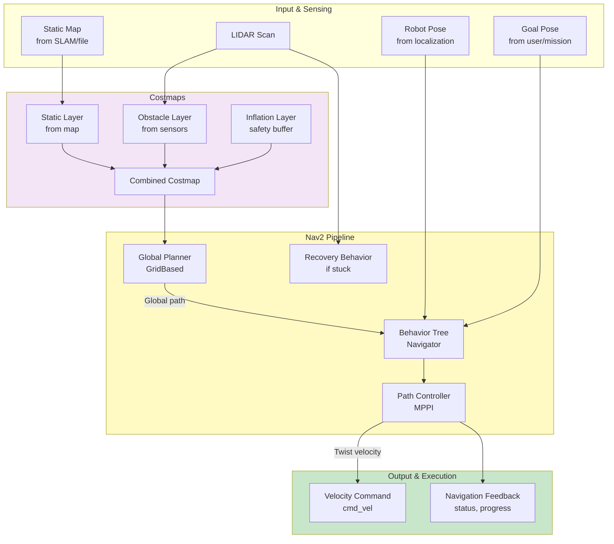
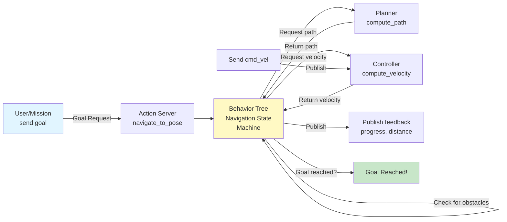
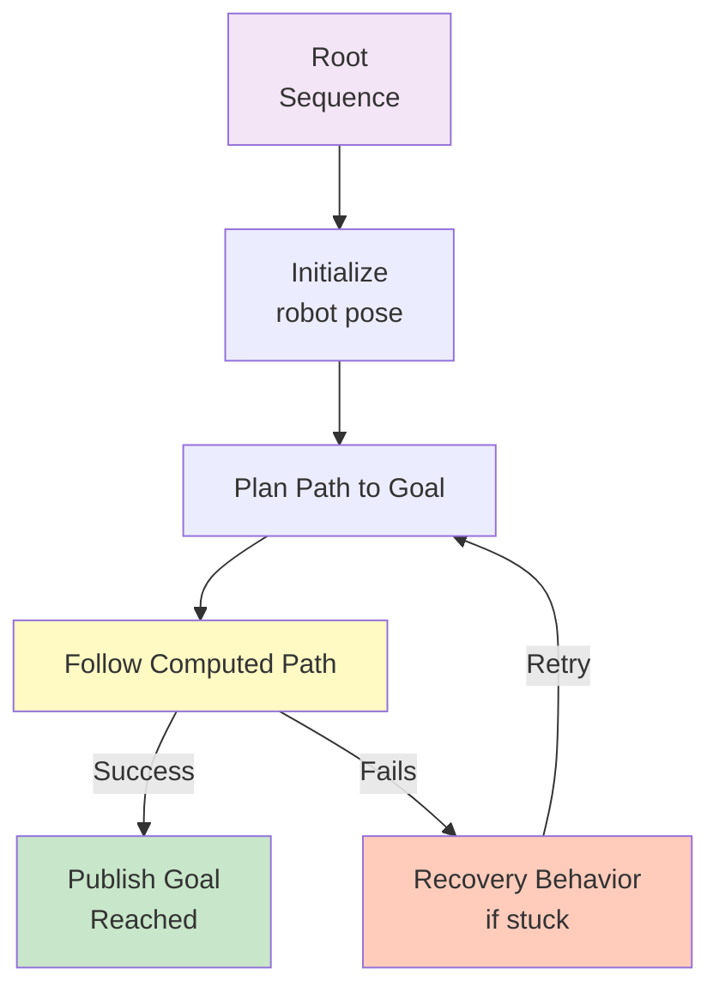

# RN Autonomous Navigation Package

Autonomous navigation package for the ROSMASTER X3 robot using Nav2 (Navigation2) framework. Provides path planning, obstacle avoidance, and autonomous mobility capabilities.

## 🎯 Purpose

This package enables:
- **Global Path Planning**: Dijkstra/A* algorithms for optimal routes
- **Local Path Tracking**: MPPI (Model Predictive Path Integral) controller
- **Obstacle Avoidance**: Real-time dynamic obstacle detection
- **Behavior Trees**: Flexible navigation state machines
- **Goal Management**: Single goal and waypoint following
- **Autonomous Mobility**: Complete end-to-end autonomous navigation

---

## 🗺️ Navigation Architecture



---

## 🔄 Navigation Data Flow



---

## 🎮 Behavior Tree Navigation

The Behavior Tree (BT) is the orchestrator that manages the navigation flow:



---

## ⚙️ Configuration Files

### Navigation Parameters

**File**: `config/rosmaster_x3_nav2_default_params.yaml`

#### AMCL (Adaptive Monte Carlo Localization)

```yaml
amcl:
  ros__parameters:
    # Motion model: omnidirectional for mecanum
    robot_model_type: "nav2_amcl::OmniMotionModel"
    
    # Particle filter setup
    min_particles: 500
    max_particles: 2000
    
    # LIDAR parameters
    laser_model_type: "likelihood_field"  # Fast, accurate
    laser_max_range: 100.0
    max_beams: 60
    
    # Update frequency
    update_min_d: 0.05      # meters
    update_min_a: 0.05      # radians
```

#### Controller Server (Path Following)

```yaml
controller_server:
  ros__parameters:
    controller_frequency: 5.0       # Hz
    min_x_velocity_threshold: 0.001
    min_y_velocity_threshold: 0.001  # Allow strafing for mecanum
    min_theta_velocity_threshold: 0.001
    
    # Controller selection
    controller_plugins: ["FollowPath"]
    goal_checker_plugins: ["general_goal_checker"]
    progress_checker_plugins: ["progress_checker"]
    
    # Goal checking tolerance
    general_goal_checker:
      plugin: "nav2_controller::SimpleGoalChecker"
      xy_goal_tolerance: 0.35        # meters
      yaw_goal_tolerance: 0.50       # radians
    
    # MPPI Controller configuration
    FollowPath:
      plugin: "nav2_mppi_controller::MPPIController"
      time_steps: 15
      model_dt: 0.2                  # 200ms per control step
      
      # Velocity limits
      vx_max: 0.5                    # Forward
      vx_min: 0.0                    # No backward
      vy_max: 0.5                    # Left-right strafing
      wz_max: 1.9                    # Angular
      
      # Motion model: omnidirectional
      motion_model: "Omni"
      
      # Sampling parameters
      batch_size: 10000
      iteration_count: 1
      
      # Cost function weights
      critics: [
        "ConstraintCritic",
        "CostCritic",
        "GoalCritic",
        "GoalAngleCritic",
        "PathAlignCritic",
        "PathAngleCritic",
        "PathFollowCritic"
      ]
```

#### Planner Server (Path Planning)

```yaml
planner_server:
  ros__parameters:
    expected_planner_frequency: 20.0
    
    # Planner plugins
    planner_plugins: ["GridBased"]
    plugins: ["nav2_navfn_planner::NavfnPlanner"]
    
    # NavFn parameters
    GridBased:
      plugin: "nav2_navfn_planner::NavfnPlanner"
      tolerance: 0.5                 # Distance to goal tolerance
      use_astar: false               # Use Dijkstra
      allow_unknown: false           # No passing through unknown
```

#### Costmap Configuration

```yaml
local_costmap:
  local_costmap:
    ros__parameters:
      update_frequency: 5.0           # Hz
      publish_frequency: 2.0
      global_frame: odom
      robot_base_frame: base_link
      use_sim_time: true
      
      # Plugins
      plugins: ["static_layer", "obstacle_layer", "inflation_layer"]
      
      static_layer:
        plugin: "nav2_costmap_2d::StaticLayer"
        
      obstacle_layer:
        plugin: "nav2_costmap_2d::ObstacleLayer"
        enabled: true
        observation_sources: ["scan"]
        scan:
          topic: /scan
          max_obstacle_height: 0.5     # meters
          padding: 0.2
      
      inflation_layer:
        plugin: "nav2_costmap_2d::InflationLayer"
        enabled: true
        inflation_radius: 0.55         # Safety buffer
        cost_scaling_factor: 1.0
```

---

## 🎛️ nav2_simple_commander Usage

Python library for programmatic goal sending:

```python
#!/usr/bin/env python3
from geometry_msgs.msg import PoseStamped
from nav2_simple_commander.robot_navigator import BasicNavigator
import rclpy

rclpy.init()
nav = BasicNavigator()

# Set initial pose
initial_pose = PoseStamped()
initial_pose.header.frame_id = 'map'
initial_pose.header.stamp = nav.get_clock().now().to_msg()
initial_pose.pose.position.x = 0.0
initial_pose.pose.position.y = 0.0
nav.setInitialPose(initial_pose)

# Spin to let initialization settle
nav.waitUntilNav2Active()

# Create goal
goal_pose = PoseStamped()
goal_pose.header.frame_id = 'map'
goal_pose.pose.position.x = 3.0
goal_pose.pose.position.y = 3.0

# Send goal and wait
nav.goToPose(goal_pose)

while not nav.isTaskComplete():
    feedback = nav.getFeedback()
    print(f"Distance to goal: {feedback.distance_remaining}")

result = nav.getResult()
if result == 4:
    print("Goal reached!")
```

---

## 🚀 Launch and Usage

### Option 1: Full Navigation Stack (Simulation)

```bash
ros2 launch rn_autonomous_gazebo rn_autonomous.gazebo.launch.py \
  world_file:=cafe.world &

sleep 3

ros2 launch rn_autonomous_navigation rosmaster_x3_navigation.launch.py \
  use_sim_time:=true
```

### Option 2: Real Robot with SLAM

```bash
# Terminal 1: Create map with SLAM
ros2 launch slam_toolbox online_async_launch.py slam_params_file:=slam_params.yaml

# Terminal 2: Start navigation (no pre-built map)
ros2 launch rn_autonomous_navigation rosmaster_x3_navigation.launch.py \
  use_sim_time:=false

# Terminal 3: After map created, save it
ros2 run nav2_map_server map_saver_cli -f ~/my_map
```

### Option 3: Real Robot with Pre-built Map

```bash
ros2 launch rn_autonomous_navigation rosmaster_x3_navigation.launch.py \
  use_sim_time:=false \
  map:=/path/to/map.yaml
```

---

## 📊 Topics

### Input Topics

| Topic | Type | Purpose |
|-------|------|---------|
| `/scan` | LaserScan | LIDAR odometry |
| `/odometry/filtered` | Odometry | Robot pose from localization |
| `/map` | OccupancyGrid | Static map for planning |
| `/tf` | TransformStamped | Transform tree |

### Output Topics

| Topic | Type | Purpose |
|-------|------|---------|
| `/cmd_vel` | Twist | Velocity commands to robot |
| `/plan` | Path | Global path being followed |
| `/local_plan` | Path | Local trajectory |
| `/navigation_feedback` | Nav2 feedback | Navigation status |

### Services & Actions

| Type | Name | Purpose |
|------|------|---------|
| Action | `/navigate_to_pose` | Go to single goal |
| Action | `/navigate_through_poses` | Follow waypoint list |
| Service | `/compute_path_to_pose` | Get path without going |

---

## 🔍 Path Planning Algorithm Comparison

| Algorithm | Speed | Optimality | Memory |
|-----------|-------|-----------|--------|
| **Dijkstra** | Fast | Optimal | Medium |
| **A*** | Faster | Optimal | Medium |
| **RRT** | Variable | Good | High |
| **RRT*** | Variable | Very Good | High |

**Default**: NavFn (Dijkstra) - good balance for indoor navigation

---

## 💡 Motion Model Explanation

### Omnidirectional Motion (Mecanum Wheels)

```
Forward:    cmd_vel.linear.x > 0
Backward:   cmd_vel.linear.x < 0
Strafe L:   cmd_vel.linear.y > 0
Strafe R:   cmd_vel.linear.y < 0
Rotate CCW: cmd_vel.angular.z > 0
Rotate CW:  cmd_vel.angular.z < 0

Combined: Any mixture simultaneously!
```

**Nav2 MPPI Controller**:
- Trajectory samples: 10,000 per step
- Predicts paths and selects best
- Considers constraints and costs
- Smooth omnidirectional motion

---

## 🛠️ Performance Tuning

### Robot Moving Slowly

1. Increase velocity limits:
   ```yaml
   vx_max: 0.7
   wz_max: 2.5
   ```

2. Reduce controller frequency or time horizon

### Jerky/Zigzag Motion

1. Increase MPPI batch size:
   ```yaml
   batch_size: 20000
   ```

2. Increase iteration count:
   ```yaml
   iteration_count: 2
   ```

### Hitting Obstacles

1. Increase inflation radius:
   ```yaml
   inflation_radius: 0.75
   ```

2. Relax goal tolerance if very close to walls:
   ```yaml
   xy_goal_tolerance: 0.5
   ```

---

## 📁 Directory Structure

```
rn_autonomous_navigation/
├── config/
│   ├── rosmaster_x3_nav2_default_params.yaml
│   └── rosmaster_x3_nav2_regulated_pure_pursuit_controller.yaml
├── launch/
│   └── rosmaster_x3_navigation.launch.py
├── maps/
│   ├── my_map.yaml
│   └── my_map.pgm
├── rviz/
│   └── nav2_default_view.rviz
├── scripts/
│   ├── send_goal.py
│   ├── navigate_waypointspy
│   └── amcl_pose_setter.py
├── src/
│   └── (C++ navigation plugins if custom)
└── README.md (this file)
```

---

## 🐛 Common Issues & Solutions

| Issue | Cause | Solution |
|-------|-------|----------|
| Robot doesn't move | No valid plan | Check map, ensure costmap layer enabled |
| Ignores obstacles | Costmap not updating | Verify sensor bridging, check `/local_costmap/costmap` |
| Infinite loops | Poor goal location | Ensure goal is in free space, increase tolerance |
| Erratic path | MPPI parameters | Tune batch_size, iteration_count |
| Navigation times out | Planner issues | Check `/computed_path` frequency |
| Cost scaling doesn't work | Inflation misconfigured | Verify inflation_radius > robot_size |

---

## 📈 Monitoring Navigation

```bash
# Available topics for debugging
ros2 topic list | grep -E "nav|costmap|plan|goal"

# Visualize costmap
ros2 run rviz2 rviz2

# Monitor controller frequency
ros2 topic hz /cmd_vel

# Check plan validity
ros2 topic echo /plan --once
```

---

## 🎓 Understanding Costmaps

```
Free space:      0 (no cost, robot can go)
Obstacle:        254 (high cost, robot avoids)
Unknown:         255 (typically don't traverse)
Inflation:       1-253 (gradient from obstacle)

Robot occupies cells around its footprint.
Inflation creates safety buffer zone.
```

---

## 📝 License

BSD-3-Clause License

---

**Last Updated**: March 2026  
**ROS 2 Version**: Jazzy  
**Nav2 Version**: Latest  
**Robot Model**: Yahboom ROSMASTER X3
